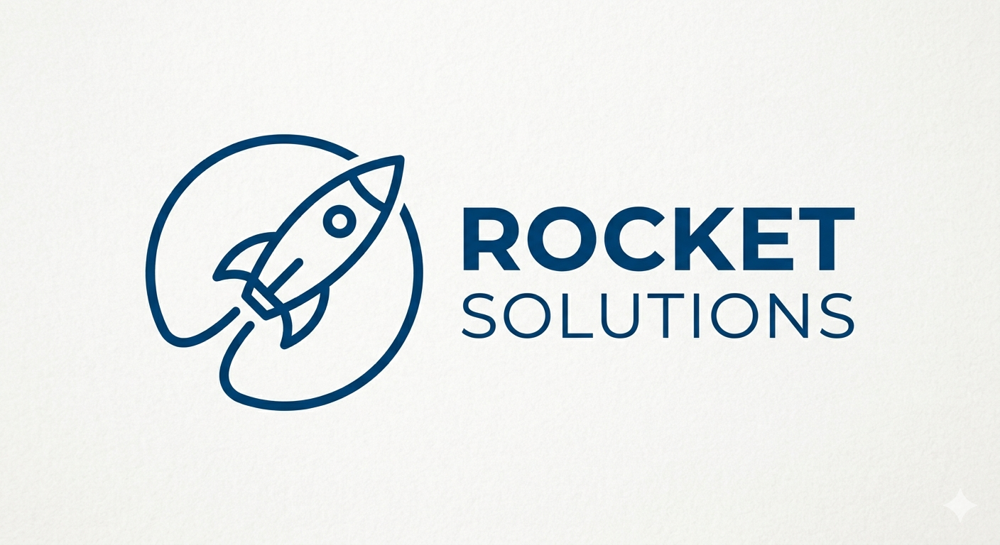

# Projeto Integrador - Implantação da Infraestrutura de TI de uma Empresa Prestadora de Serviços

## Objetivo Geral

Planejar, implantar, documentar e apresentar uma infraestrutura completa de TI para uma empresa fictícia de prestação de serviços, utilizando servidores Windows e Linux, rede corporativa, sistema de chamados e aplicação web.

---

## Logotipo

---

## Topologia da Rede

---

## Plano de endereçamento IP

---

## Conteúdo

Para informações mais detalhadas sobre o projeto siga a [wiki](https://github.com/reginaldotfilho/Rocket-Solutions/wiki) do repositório.

---

## Autores

Alunos:
- Reginaldo Filho
- Gustavo Massenio
- Anderson Wilmer
- Ryan Ferreira
- Gabriel Alexandre
- Felippe Camargo

Professores:
- José de Assis
- Leandro Ramos
